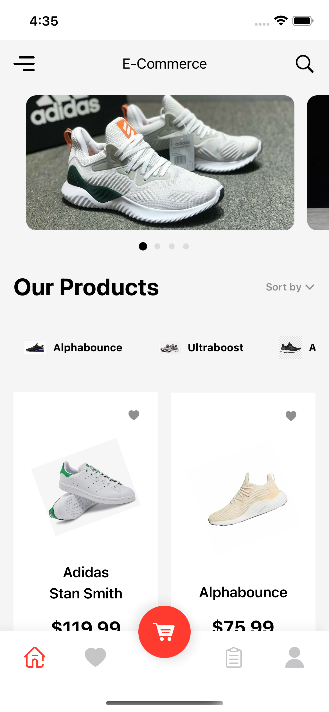

# eCommerce-SwiftUI
eCommerce iOS app UI using SwiftUI


[](https://opensource.org/licenses/Apache-2.0)

## Screenshots



## Features

* SwiftUI Complex UI
* SwiftUI Matched Geometry Effect
* SwiftUI Custom Tab Bar 
* SwiftUI Curved Tab Bar
* SwiftUI LazyGrids
* SwiftUI Animations
* Snap Carousel Slider
* SwiftUI Drag Gesture
* SwiftUI Geometry Reader
* SwiftUI Custom Paging Control
* SwiftUI Custom Segmented Control

## License

```
Copyright 2023 leminhcse

Licensed under the Apache License, Version 2.0 (the "License");
you may not use this file except in compliance with the License.
You may obtain a copy of the License at

   http://www.apache.org/licenses/LICENSE-2.0

Unless required by applicable law or agreed to in writing, software
distributed under the License is distributed on an "AS IS" BASIS,
WITHOUT WARRANTIES OR CONDITIONS OF ANY KIND, either express or implied.
See the License for the specific language governing permissions and
limitations under the License.
```
